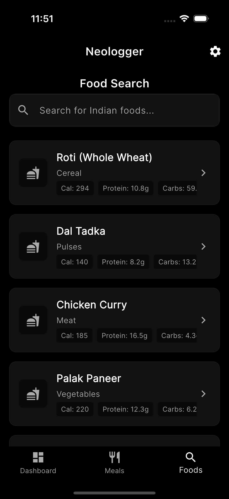

<p align="center">
  
</p>

# Neologger - Food Nutrition Tracker

A nutrition tracking app

<p align="center">
  
  &nbsp;&nbsp;
  
</p>

## Features

- **Food Database**: Pre-loaded with 542+ Indian foods from the IFCT2017 database
- **Meal Logging**: Track your meals with detailed nutrition information
- **Macro Tracking**: Visualize your progress with sleek progress circles
- **Food Search**: Find foods with elegant autocomplete search
- **Nutrition Insights**: Understand your eating patterns with detailed analytics
- **Calendar View**: Track meals by date
- **Nutrition Goals**: Set and track daily nutrition targets


## Tech Stack

- **Flutter**: Cross-platform mobile development
- **SQLite**: Local database storage
- **Provider**: State management
- **MVVM Architecture**: Clean separation of concerns
- **Google Fonts**: Inter font family
- **Mobile Scanner**: Barcode scanning capabilities
- **fl_chart**: Beautiful data visualizations
- **Open Food Facts API**: Free barcode scanning API

## Database

The app comes pre-loaded with authentic Indian food nutrition data from the IFCT2017 database, covering:
- 542+ foods
- Regional dishes
- Street foods
- Traditional preparations
- Cereals and grains
- Pulses and legumes
- Vegetables
- Meat and seafood
- Dairy products
- Snacks and appetizers
- Sweets and desserts
- Beverages
- Prepared foods

## Installation

1. Clone the repository:
   ```bash
   git clone https://github.com/yourusername/neologger.git
   ```

2. Install dependencies:
   ```bash
   flutter pub get
   ```

3. Run the app:
   ```bash
   flutter run
   ```

## API Keys

This app uses only completely free services with no mandatory API keys:

1. **Open Food Facts API**: Completely free with no rate limits or API keys required

The app works fully offline with the pre-loaded Indian food database. API access is optional for extended food database access.


## Architecture

This app follows the MVVM (Model-View-ViewModel) architecture pattern with Provider for state management:

```
lib/
├── models/           # Data models (Food, Meal)
├── database/         # Database helper and operations
├── providers/        # State management (FoodProvider, MealProvider)
├── screens/          # UI screens
├── widgets/          # Reusable UI components
├── constants.dart    # App-wide constants
└── main.dart        # App entry point
```

## Contributing

Contributions are welcome! Please feel free to submit a Pull Request.

1. Fork the repository
2. Create your feature branch (`git checkout -b feature/AmazingFeature`)
3. Commit your changes (`git commit -m 'Add some AmazingFeature'`)
4. Push to the branch (`git push origin feature/AmazingFeature`)
5. Open a Pull Request

## License

This project is licensed under the MIT License - see the [LICENSE](LICENSE) file for details.

## Acknowledgments

- Nutrition data from the [IFCT2017 database](https://ifct2017.com/)
- Barcode scanning powered by [Open Food Facts](https://world.openfoodfacts.org/)
- Built with [Flutter](https://flutter.dev/)
